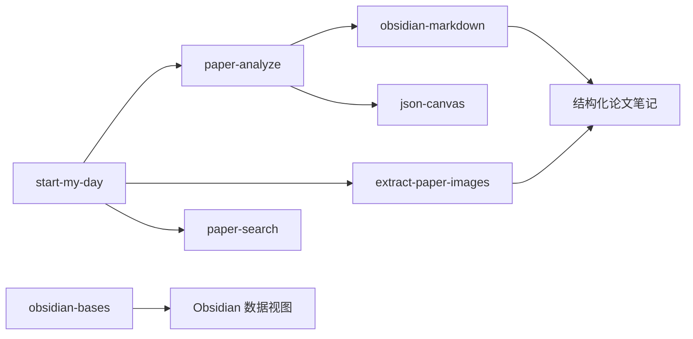

# Obsidian Research Skills Hub

一个面向 **论文检索/分析/知识沉淀** 的 Skills 集合仓库，服务于 Obsidian 知识库工作流。  
当前目录内共包含 **7 个 skill**，覆盖从“找论文”到“产出结构化笔记”的完整链路。

## 项目包含的 Skills

| Skill | 目录 | 主要用途 | 关键输出 |
|---|---|---|---|
| `start-my-day` | `start-my-day/` | 每日启动研究流：抓取并筛选高价值论文推荐 | `10_Daily/YYYY-MM-DD论文推荐.md`、`arxiv_filtered.json` |
| `paper-analyze` | `paper-analyze/` | 深度分析单篇论文，生成图文并茂的 Obsidian 笔记 | 论文分析笔记、知识图谱节点/边更新 |
| `extract-paper-images` | `extract-paper-images/` | 从论文中提取图片（优先 arXiv 源码包） | `images/`、`images/index.md`、可引用图片路径 |
| `paper-search` | `paper-search/` | 在已有论文笔记中按关键词/作者/标签检索 | 分组后的候选论文结果与相关性评分 |
| `obsidian-markdown` | `obsidian-markdown/` | 规范化 Obsidian Markdown（wikilink/embed/callout/frontmatter） | 可直接在 Obsidian 渲染的 `.md` |
| `obsidian-bases` | `obsidian-bases/` | 创建与编辑 Obsidian `.base` 数据视图 | 带 filters/formulas/views 的 `.base` |
| `json-canvas` | `json-canvas/` | 创建与编辑 Obsidian `.canvas` 画布 | 符合 JSON Canvas 规范的 `.canvas` |

<a href="[https://your-blog-url.com](https://blog.csdn.net/m0_59012280/article/details/158737734?spm=1001.2014.3001.5501)">
  
</a>


## 核心能力亮点

1. **源码优先图片提取**：`extract-paper-images` 优先从 arXiv 源码目录（`pics/figures/images`）取图，减少 PDF logo/装饰图噪声。
2. **自动化推荐评分**：`start-my-day` 基于相关性/新近性/热门度/质量进行综合评分并排序。
3. **深度分析闭环**：`paper-analyze` 结合论文元数据、结构化模板、图片引用和知识图谱更新形成闭环。
4. **Obsidian 原生兼容**：`obsidian-markdown`、`obsidian-bases`、`json-canvas` 覆盖文档、数据库视图和画布三种核心形态。
5. **知识链接增强**：`start-my-day/scripts/link_keywords.py` 可将关键词自动转换为 wikilink，增强笔记互联。

## 技能协作关系



## 目录结构

```text
skills/
├─ extract-paper-images/
│  ├─ skill.md
│  └─ scripts/extract_images.py
├─ paper-analyze/
│  ├─ skill.md
│  └─ scripts/
│     ├─ generate_note.py
│     └─ update_graph.py
├─ start-my-day/
│  ├─ skill.md
│  └─ scripts/
│     ├─ search_arxiv.py
│     ├─ scan_existing_notes.py
│     ├─ link_keywords.py
│     └─ common_words.py
├─ paper-search/
│  └─ skill.md
├─ obsidian-markdown/
│  ├─ SKILL.md
│  └─ references/
├─ obsidian-bases/
│  ├─ SKILL.md
│  └─ references/
└─ json-canvas/
   ├─ SKILL.md
   └─ references/
```

## 快速上手（脚本调试）

> 常规使用方式是通过 Skill 调用；以下命令用于本地脚本调试。

1. 安装依赖（示例）：

```bash
pip install requests pyyaml pymupdf
```

2. 设置 Obsidian Vault 路径：

```bash
export OBSIDIAN_VAULT_PATH="/path/to/your/vault"
# Windows PowerShell:
# $env:OBSIDIAN_VAULT_PATH="D:\YourVault"
```

3. 典型脚本入口：

```bash
# 每日论文搜索与筛选（由 start-my-day 使用）
python start-my-day/scripts/search_arxiv.py --help

# 从论文提取图片
python extract-paper-images/scripts/extract_images.py --help

# 生成分析笔记模板
python paper-analyze/scripts/generate_note.py --help

# 更新论文知识图谱
python paper-analyze/scripts/update_graph.py --help
```

## 适用场景

- 搭建个人/团队 AI 论文情报系统
- 在 Obsidian 内形成“检索 -> 分析 -> 关联 -> 回顾”的研究闭环
- 快速沉淀可复用的论文笔记模板、画布与数据库视图
